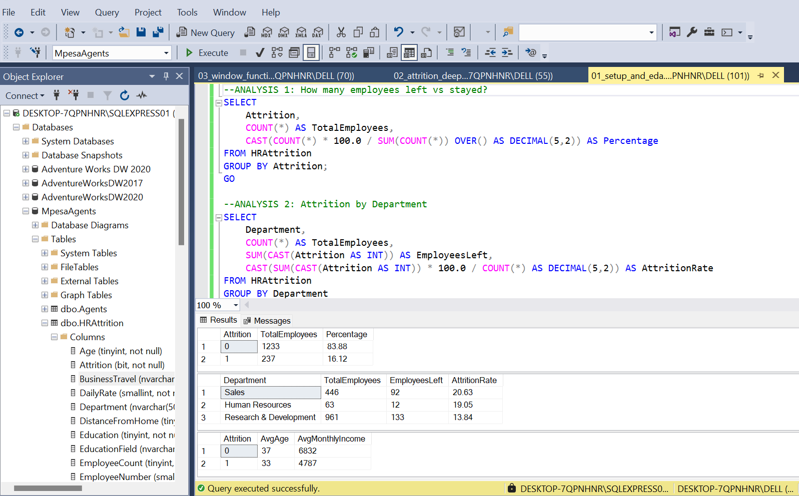
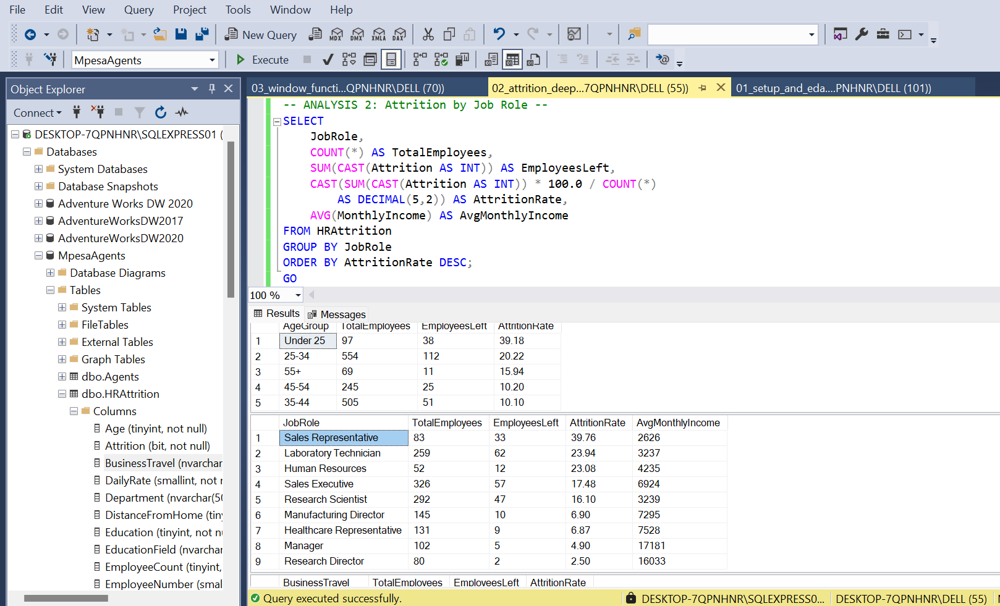

# IBM HR Attrition Analysis — SQL Project

**Author:** Duncan Chicho (NC-Dan) | Open to Remote Contribution    
**Tool:** Microsoft SQL Server  
**Dataset:** IBM HR Analytics Employee Attrition Dataset (Kaggle)  
**Records:** 1,470 employees | 35 columns  

---

## Business Problem

Employee attrition costs organisations significantly in recruitment, 
onboarding and lost productivity. This project uses SQL to identify 
the key drivers of attrition at IBM and quantify the business risk 
by department, role, age group and compensation level.

---
- Overall Attrition preview 

---

## Key Findings

### Finding 1 — Overall Attrition Rate
- 237 out of 1,470 employees left — a 16.12% attrition rate
- 1,233 employees (83.88%) were retained

### Finding 2 — Sales Is the Highest Risk Department
- Sales: 20.63% attrition rate (92 of 446 employees left)
- Human Resources: 19.05%
- Research & Development: 13.84%

### Finding 3 — Compensation Gap Between Leavers and Stayers
- Employees who left earned an average of $4,787/month
- Employees who stayed earned an average of $6,832/month
- A $2,045 monthly gap — compensation is a primary driver

### Finding 4 — Young Employees Are Most at Risk
- Under 25: 39.18% attrition rate — nearly 1 in 2 employees leaves
- 25-34: 20.22%
- 35-44: 10.10% — most stable age group

### Finding 5 — Income Is the Strongest Predictor of Retention
- Sales Representatives: 39.76% attrition | $2,626 avg income — highest risk
- Research Directors: 2.50% attrition | $16,033 avg income — most stable
- Managers: 4.90% attrition | $17,181 avg income
- The income-attrition relationship is consistent across all 9 job roles
- Average income preview

### Finding 6 — Travel Frequency Drives Attrition
- Frequent travellers: 24.91% attrition
- Rare travellers: 14.96%
- Non-travellers: 8.00%

---
🎯 THE RECOMMENDATIONS

1️⃣ Revise Sales Representative compensation urgently
At $2,626/month with 39.76% attrition, the cost of replacing these employees far exceeds the cost of raising their base salary. This is the single highest-return intervention available.

2️⃣ Build a structured early career programme
With 39.18% of under-25 employees leaving, IBM is losing its talent pipeline before it matures. Mentorship, clear progression paths and early salary reviews would directly address this.

3️⃣ Review the travel policy for high-frequency roles
Frequent travellers leave at 3x the rate of non-travellers. Introducing travel allowances, rotation policies or remote work options for travel-heavy roles would reduce this risk significantly.

4️⃣ Use income benchmarking as a retention early warning system
The data shows a clear income threshold below which attrition accelerates. HR teams should flag employees earning significantly below their department average for proactive retention conversations.

---

## SQL Skills Demonstrated

- SELECT, WHERE, GROUP BY, HAVING, ORDER BY
- Aggregate functions: COUNT, SUM, AVG
- CASE WHEN for age banding and segmentation
- INNER JOIN and CTE for department comparisons
- Window Functions: RANK() PARTITION BY, SUM() running totals
- Subqueries for network-level benchmarking
- CAST for data type conversion in calculations

---

## Project Files

| File | Description |
|---|---|
| 01_setup_and_eda.sql | Table verification, overall attrition rates, dept summary |
| 02_attrition_deep_dive.sql | Age band, job role and travel analysis |
| 03_window_functions.sql | Rankings, dept comparisons, running totals |

---

## Dataset Source

[IBM HR Analytics Employee Attrition Dataset](https://www.kaggle.com/datasets/pavansubhasht/ibm-hr-analytics-attrition-dataset)  
Available on Kaggle — created for educational purposes 

---
## | Other SQL Projects |

- 🔗[olist-ecommerce-sql-analysis](https://github.com/NC-Dan/olist-ecommerce-sql-analysis)

---
## | Other Excel Analyst Projects |  
- 🔗[Global-superstore-sales-dashboard](https://github.com/NC-Dan/global-superstore-sales-dashboard)
- 🔗[Kenya Banking Risk Dashboard](https://github.com/NC-Dan/kenya-banking-risk-dashboard)
- 🔗[Healthcare Analytics — Patient Admission, Cost & Risk](https://github.com/NC-Dan/healthcare-analytics-dashboard/tree/main)

---
- Connect with me on Linkedin🔗[www.linkedin.com/in/duncanalyst](https://www.linkedin.com/in/duncanalyst/?skipRedirect=true)
